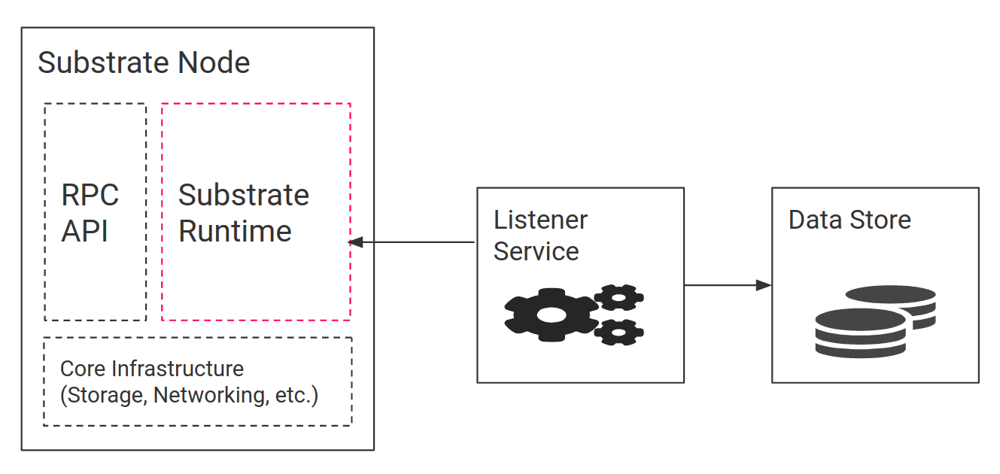

# Substrate Events Listener & Storage Adapter

**Archived** - This repository is no longer up-to-date or maintained. Please refer to [Substrate Archive](https://github.com/paritytech/substrate-archive).

A simple node.js based web-socket listener which subscribes to Parity Substrate runtime events and stores them in a data store. At the moment, MongoDB is supported but new stores can be added easily.

Substrate node and data sink related config lives in the `.env` file.

## Motivation

Ideally, we should avoid running iterators and loops on the on-chain data stored in a blockchain runtime or smart contract. The chain should store the minimum amount of data which is needed for conflict resolution. Everything else can and should be stored off-chain with it's hash on the chain. In cases where on-chain data is stored in collections (maps) and needs to be shown on a UI, an event based approach can be used to build an off-chain storage which can be queried directly from the UI.



This app listens to all Substrate runtime events using the web-socket connection, parses each event based on (extensible) custom rules and then stores the processed event data in one or more data stores. This off-chain storage can then be used for data analysis, querying, showing it on the UI, etc.

## Event Subscription

This application uses the [Polkadot JS API](https://github.com/polkadot-js/api) javascript client library to subscribe to Substrate events. If the Substrate runtime your are connecting to uses custom types, please make sure that your have made [corresponding changes](https://polkadot.js.org/api/api/#registering-custom-types) to the API  [server.js](./server.js) file.

## Usage

* Clone this repository.
* Make sure your Substrate node and MongoDB is running. Update the `.env` file with the server and ports, if needed.
* Set event section filters (comma separated list of module names, no spaces) in the `.env` file to process filtered events.

For example, to select all events,

```env
SUBSTRATE_EVENT_SECTIONS=all
```

and to select events only from `balances`,`assets`,`token` modules,

```bash
SUBSTRATE_EVENT_SECTIONS=balances,assets,token
```

* Install packages and start the listener.

```bash
npm install
npm start
```

## Sample output

Once the application is setup and running properly, the terminal will log all events inserted into the data store.

```bash
$ npm start

> substrate-listener@0.1.0 start /home/gd/code/events-listener
> node server.js

mongodb://127.0.0.1:27017/substrate_events
Connected to MongoDB server mongodb://127.0.0.1:27017/substrate_events
Event Received: 1563368885598: {"section":"system","method":"ExtrinsicSuccess","meta":"[ An extrinsic completed successfully.]","data":"[]"}
Event Received: 1563368890319: {"section":"system","method":"ExtrinsicSuccess","meta":"[ An extrinsic completed successfully.]","data":"[]"}
Event Received: 1563368900308: {"section":"system","method":"ExtrinsicSuccess","meta":"[ An extrinsic completed successfully.]","data":"[]"}
...
...
...
```

## Add new data stores

To use a new data store with the listener,

1. Create the storage client in the `adaptors` dir (similar to existing mongo client).
2. Add the connection config in `.env` and use it in the js client.
3. Import the new js client in `dataService.js`.
4. Use init() for initializing the client - connection, priming, etc.
5. Use insert() for (of course) inserting substrate events data.

## Note

When using this approach of maintaining an off-chain store, there could be sync issues because of network partitions or temporary forks on the chain.

To get a better idea of sync status between the on-chain and off-chain stores, the off chain store could be extended to also maintain the latest block number. When querying from the off-chain store, the block numbers in both places (on-chain and off-chain) could be compared to ensure that the data in the off-chain store is not stale. (This part is not implemented in this sample.)

The off-chain storage approach presented here should not be used as-is in a production application. Solutions for corrective measures (for bringing the stores in sync) should be defined in the context of the use-case, before implementing this approach.

## Disclaimer

This app is **not** for production usage. It is mainly built to suggest an event based pattern for priming an off-chain storage. Please feel free to extend and use as needed.
